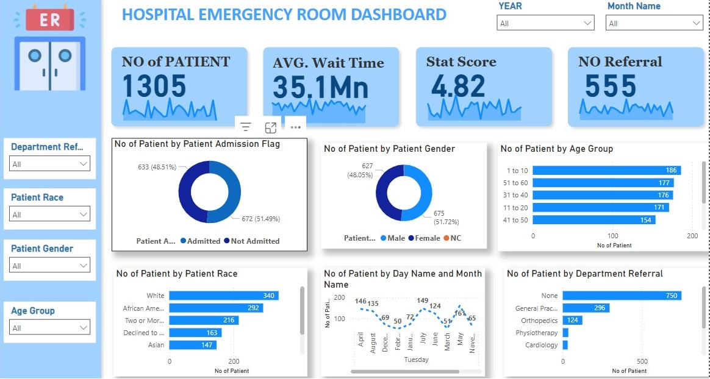

# HEMS
We need to create a hospital emergency room analysis dashboard in Power BI to enhance operational efficiency and provide actionable insights into emergency room performance.

---
## Problem Statement 
Objective: Monitor key metrics and trends on a month-by-month basis to identify patterns and areas for
improvement.

## Charts to Develop:
• Patient Admission Status: Track admitted vs. non-admitted patients.
• Patient Age Distribution: Group patients by 10-year age intervals.
• Department Referrals: Analyze referral trends across different departments.
• Timeliness: Measure the percentage of patients seen within 30 minutes.
• Gender Analysis: Visualize patient distribution by gender.
• Racial Demographics: Analyze patient data by race.
• Time Analysis: Assess patient volume by day and hour.

---
## VISUALIZATION

---
## Insights & Recommendations

1. Patient Admission Trends
Insight: Admitted patients (672) slightly outnumbered non-admitted patients (633), suggesting a higher demand for inpatient care.
Recommendation: Prioritize resource allocation (e.g., beds, staff) for inpatient services while maintaining outpatient capacity to address this imbalance.

2. Gender Distribution
Insight: Males accounted for the majority of patients (675 vs. 627 females and 3 non-communal), indicating potential gender-specific health needs or care-seeking behaviors.
Recommendation: Investigate underlying causes (e.g., higher male susceptibility to certain conditions) and ensure equitable access to care for all genders.

3. Age Group Dynamics
Insight: Pediatric patients (1–10 years) represented the largest cohort (186 patients), exceeding the smallest group (71–80 years) by 30.99%.
Recommendation: Strengthen pediatric care infrastructure and develop targeted geriatric programs to address the lower representation of older adults.

4. Racial Disparities
Insight: White patients (340) disproportionately outnumbered Native American/Alaska Native patients (72), with a 372.22% difference.
Recommendation: Address systemic barriers to care for underrepresented racial groups through outreach programs and culturally sensitive healthcare initiatives.

5. Seasonal/Day-Specific Demand
Insight: Tuesdays in May accounted for 12.34% of total patient volume, signaling potential seasonal or weekday-specific demand spikes.
Recommendation: Optimize staffing schedules during high-demand periods and analyze external factors (e.g., seasonal illnesses) driving this trend.

6. Referral Patterns
Insight: Patients with “None” listed as their referral source dominated (750), vastly exceeding those referred via renal departments (20).
Recommendation: Evaluate referral processes to identify gaps (e.g., underutilization of renal referrals) and improve interdepartmental coordination for specialized care.

## General Recommendations
Conduct root-cause analyses to understand disparities in age, race, and referral patterns.
Use data-driven forecasting to align resources with demographic and seasonal trends.
Promote equity-focused policies to ensure accessible care for underrepresented groups.

